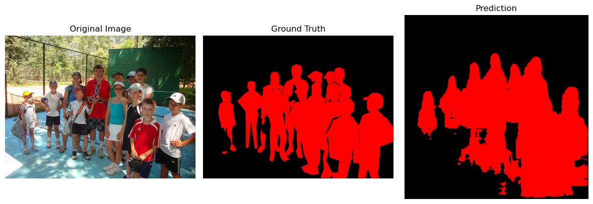
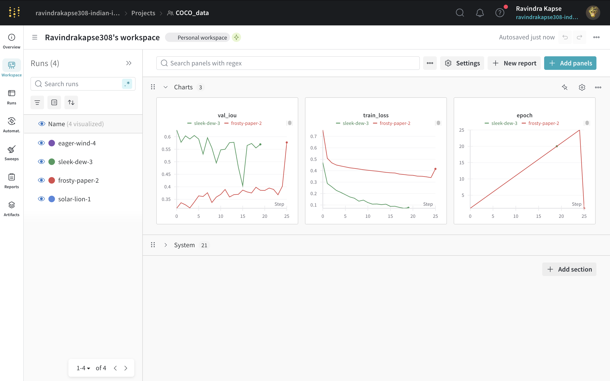

# 📝 COCO Segmentation: Task 1 - Dataset Preparation + Model Evaluation

## 🌀 Task 1: Dataset Preparation

We processed the **COCO val2017 dataset** to extract segmentation masks for a selected subset of classes:

### 🔹 Selected Classes:

- Person
- Car
- Bus
- Dog

### ⚖️ Mask Generation Script Highlights:

- Uses `pycocotools` to parse COCO annotations
- Generates two types of masks:
  - `masks_raw/`: grayscale masks with class indices (used for training)
  - `masks_colored/`: RGB visualization masks with per-class color
- Handles overlapping annotations using class priority

---

## 💡 Task 2: Model Training and Evaluation

We trained segmentation models on the generated masks using different architectures and techniques:

### 🏋️ Models Trained:

- **U-Net** (baseline)
- **DeepLabV3 + ResNet50**
- **DeepLabV3 + ResNet50** with:
  - Class Weighting
  - Oversampling
  - Focal Loss
 
### ⚙️ Techniques Used:

- **Class Weighting**: Addressed pixel imbalance by assigning higher weights to rare classes (like bus, dog) and lower weight to dominant ones (person).
- **Oversampling**: Rare-class images were duplicated in the dataset to improve representation during training.
- **Focal Loss**: Modified loss function that down-weights easy examples and focuses on hard-to-classify pixels.

### 📃 Why DeepLabV3?

- DeepLabV3 is a state-of-the-art semantic segmentation architecture with an atrous spatial pyramid pooling (ASPP) module that helps in capturing multiscale context.
- It outperforms U-Net in complex scenes by learning high-resolution details through its deeper ResNet backbone.
- By fine-tuning DeepLabV3 on a COCO subset, we leveraged pretrained weights while adapting the classifier for our specific task.


### 🔢 Evaluation Metric:

- **Mean Intersection over Union (mIoU)**
- Class-wise IoUs (class 0 = background)

---

## 📊 Model Results:



### 🔍 U-Net

```
Class 0: IoU = 0.8980
Class 1: IoU = 0.3620
Class 2: IoU = 0.0000
Class 3: IoU = 0.0000
Class 4: IoU = 0.0003
```

### 🔍 DeepLabV3-ResNet50 (Baseline)

```
Class 0: IoU = 0.9364
Class 1: IoU = 0.5739
Class 2: IoU = 0.1814
Class 3: IoU = 0.2083
Class 4: IoU = 0.0792
```

### 🔍 DeepLabV3 + Class Weights

```
Class 0: IoU = 0.9229
Class 1: IoU = 0.5642
Class 2: IoU = 0.1218
Class 3: IoU = 0.1469
Class 4: IoU = 0.0543
```

### 🔍 DeepLabV3 + Oversampling

```
Class 0: IoU = 0.9390
Class 1: IoU = 0.5850
Class 2: IoU = 0.1886
Class 3: IoU = 0.3040
Class 4: IoU = 0.0714
```

### 🔍 DeepLabV3 + Focal Loss

```
Class 0: IoU = 0.9382
Class 1: IoU = 0.5991
Class 2: IoU = 0.1931
Class 3: IoU = 0.2463
Class 4: IoU = 0.0518
```

---

## 📊 Wandb UI:
-For training metrics

